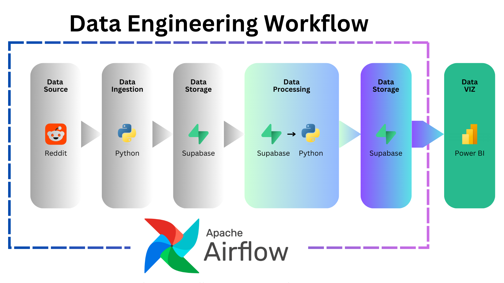
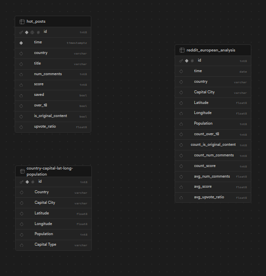
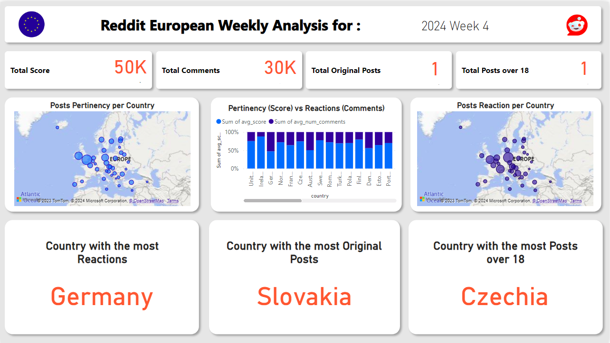
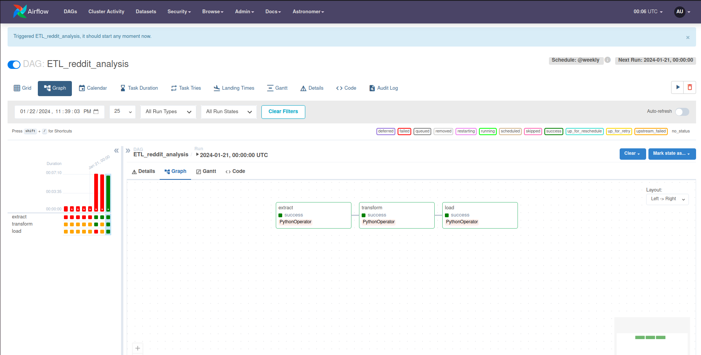

# Project Overview

This project is dedicated to conducting a weekly analysis of European Reddit activity. It involves executing a data pipeline through Airflow, with scheduled runs every week.

## 1. Data Engineering Workflow

In this section, a data engineering workflow orchestrated by [Airflow](https://airflow.apache.org/) was implemented.



### Data Source - REDDIT (PRAW)

[PRAW (Python Reddit API Wrapper)](https://praw.readthedocs.io/en/latest/) is a library to interact with the Reddit API. We wrote code to authenticate with Reddit, retrieve posts and comments, and perform various operations such as upvoting, downvoting, and commenting. This allowed us to gather the necessary data for our analysis.

### Data Ingestion (Extract)

[Reddit API](https://www.reddit.com/dev/api/) was used to extract posts and comments related to European topics. By making API requests, we retrieved the necessary data from Reddit's servers.

### Data Storage (Load)

[Supabase](https://supabase.io/), an open-source alternative to Firebase, which provides a PostgreSQL database with a built-in API. Supabase allows to easily store and manage our Reddit data, enabling efficient querying and manipulation.

As you can see here; I have three tables in my Database



### hot_posts table

This table contains **hot** submissions from Reddit posts, the one used to extract raw data from Reddit

### country-capital-lat-long-population

Table that contains for almosr each country in the world, its population, capital, longitude, and latitude.

[Source : github/ofou/country-capital-lat-long-population.csv
](https://gist.github.com/ofou/df09a6834a8421b4f376c875194915c9)

### reddit_european_analysis table

The final table that contains for each European Country : Country Caracteristics (Capital City, Latitude, Longitude, Population) , and some Reddit Usage Statistics (count over 18 posts, count of original content, count number comments, count score, avgerage number of comments, average score, average upvote ratio)

### Data Processing (Transform)

After extracting the data, various processing and transformations was performed to clean and filter it for the two tables `hot_posts` and `country-capital-lat-long-population`.

This involved removing irrelevant information, formatting data into a consistent structure, and handling any inconsistencies or errors.

### Final Data Storage (Load)

Once the data was transformed, it was loaded into a Supabase database for further analysis.

By implementing this workflow, I were able to gather, clean, and load the necessary data from Reddit for our analysis.

## 2. Dashboard and Visualisation

Using [Power BI](https://www.microsoft.com/en-us/power-platform/products/power-bi) for Data Visualisation, here is the main Dashboard



* This dashboard highlights the Reddit Weekly Analysis

* You can find the dashboard file in : `./src/dashboard/reddit_european_weekly_analysis_dashboard.pbix`

* A Python script for automating the weekly refresh of this dashboard will be available soon.

## 3. Airflow et Astro dev

[Airflow](https://airflow.apache.org/) and [Astro dev](https://astro.dev/) were incorporated into the project. Airflow is a platform to programmatically author, schedule, and monitor workflows, while Astro dev is a tool for managing infrastructure as code. I used Airflow to schedule and automate our ETL process, ensuring that data is regularly updated. Astro dev helped us manage our infrastructure, making it easier to deploy and scale our project.

This is the ETL DAG shown in Airflow :



These four sections provide a comprehensive overview of our project, covering data extraction, Reddit API integration, database management, and workflow automation.

## Getting Started

To clone and use this project, follow these steps:

1. Clone the repository to your local machine using the following command:
    ```
    git clone https://github.com/ilyesdjerfaf/Reddit-European-Analysis.git

    cd Reddit-European-Analysis
    ```

2. Install the required dependencies by running the following command in the project's root directory: (optionnal)
    ```
    pip install -r requierements.txt
    ```

3. Please make sure to install **astro** and **docker**, follow this link : [Astro CLI](https://docs.astronomer.io/astro/cli/install-cli)

4. Once **astro** and **docker** are installed, run this command to start the pipeline
    ```
    cd airflow

    astro dev start
    ```

5. Access the application in your web browser at `http://localhost:8080`.

6. **IMPORTANT** : CHECK YOUR REDDIT and SUPABASE CREDENTIALS. If you want to work with my credentials, contact me

By following these steps, you will be able to clone the project, install the dependencies, set up the necessary environment variables, run the ETL process, and start the application. Feel free to explore the different features and functionalities of the project.

If you encounter any issues or have any questions, please don't hesitate to reach me out.
